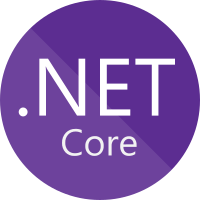

### Hello there, 👋

My name is Kyle Laverty and I'm a Software Development Manager from Canada.

### 👪 I'm a Husband, Father, Developer and Manager:
- 🔭 I’m currently working on work 😄
- 🌱 I’m currently learning some basic Unity and Godot
- 💬 Ask me about AWS, C#, WPF, Terraform
- 😄 Pronouns: he/him

### 💼 Where i am currently working:
- [OCAS](https://www.ocas.ca/)

### 📫 Where to find me:

    &nbsp;&nbsp;
    

### Languages and Tools:

### Stats

 

